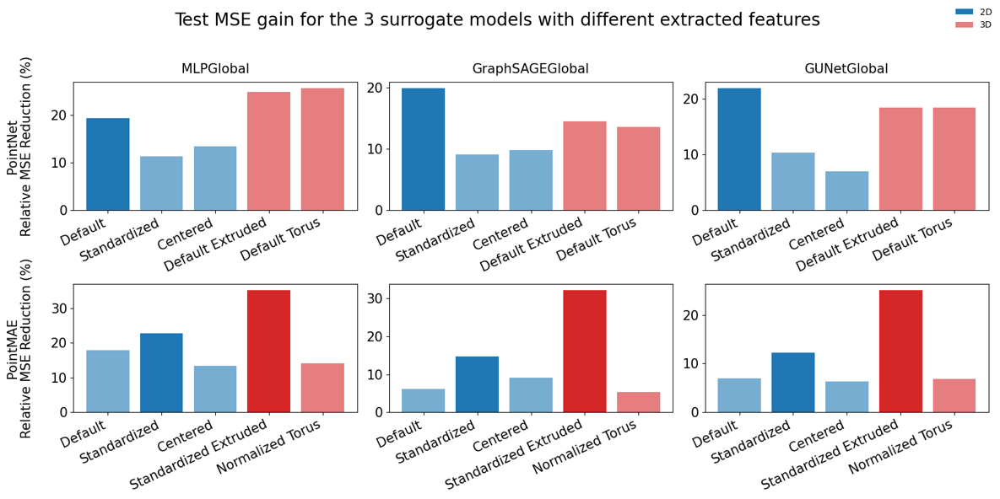
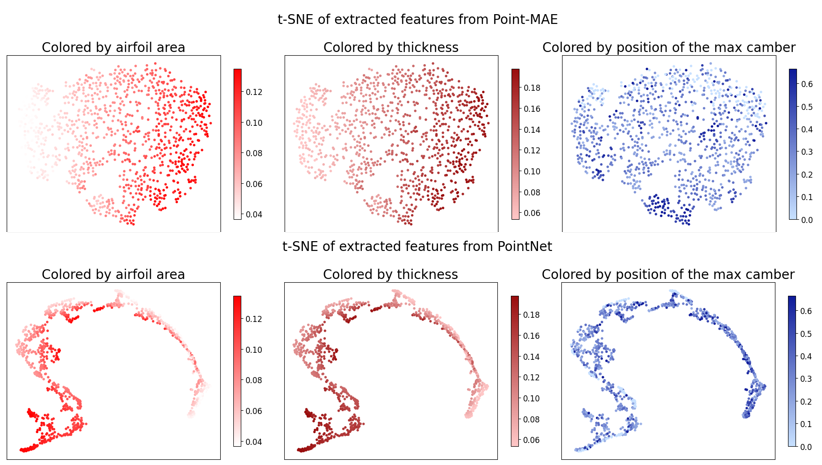
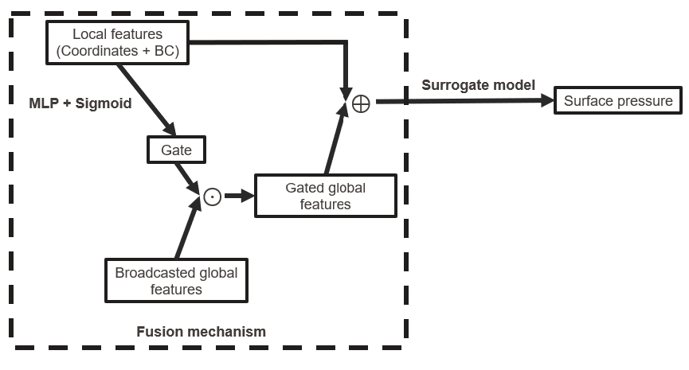
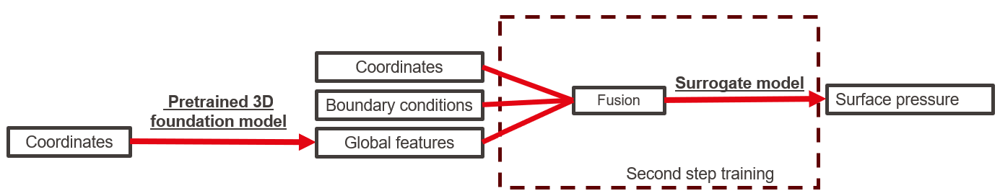

# Pretrained 3D Foundation Models for Airfoil Surrogate Modeling

This repository implements a decoupled learning strategy to accelerate aerodynamic design. By leveraging 3D Foundation Models (PointNet and PointMAE) pretrained on ShapeNet, we extract geometric features to improve the accuracy of CFD surrogate models, specifically for surface pressure prediction.

## Key Features

* **Decoupled Learning:** Uses frozen 3D encoders to extract geometric priors, reducing reliance on expensive labeled CFD data.
* **Geometric Alignment:** Strategies to bridge the gap between 2D airfoils and 3D vision models including 3D Extrusion, Torus Embedding, and Optimal Transport.
* **Adaptive Fusion:** A learned gating mechanism that dynamically modulates the influence of global context based on local point requirements.
* **Benchmarking:** Evaluated across four baseline architectures: MLP, GraphSAGE, Graph U-Net, and PointNet.

## Core Findings
* **Latent Space Relevance:** t-SNE visualizations confirm that these models inherently encode physical properties such as thickness, area, and camber.
* **Performance Gains:** Reconstruction-based pretraining (PointMAE) combined with 3D extrusion yields performance gains of up to 35%.
* **Pretraining Objectives:** PointMAE (reconstruction) provides a more descriptive and continuous representation of the airfoil manifold compared to PointNet (classification).


## Methodology

### 1. Geometric Alignment
To resolve the topological mismatch between 2D contours and 3D volumes, we employ 3D Extrusion. This process involves computing the convex hull and sampling points to create depth, effectively aligning the data with the ShapeNet distribution.

### 2. System Architecture
The pipeline consists of a frozen 3D encoder, a gated fusion mechanism, and a downstream surrogate decoder.

### 3. Fusion Mechanism
Global features $F_{global}$ are integrated with local features $F_{local}$ via a sigmoid-based gating mechanism:

$$G = \sigma(\text{MLP}(F_{local}))$$
$$F_{fused} = F_{local} + (G \odot F_{global})$$



## Usage

### 1. Installation
```bash
# Clone the repository
git clone [https://github.com/RomainCorbel/Pretrained-3D-Foundation-Models-for-Airfoil-Surrogate-Modeling.git](https://github.com/RomainCorbel/Pretrained-3D-Foundation-Models-for-Airfoil-Surrogate-Modeling.git)

# Install dependencies using anaconda
conda env create -f environment.yml
conda activate torch128
```

### 2. Downloads
The following datasets and pretrained models are required for the pipeline:

* **Datasets**:
    * `shapenetcore_partanno_segmentation_benchmark_v0`: Place inside `Foundation_Models/` https://www.kaggle.com/datasets/mitkir/shapenet?resource=download-directory or https://aistudio.baidu.com/datasetdetail/314659
    * `AirfRANS dataset`: Place at the root in `/Dataset` https://airfrans.readthedocs.io/en/latest/notes/dataset.html#downloading-the-dataset
* **Pretrained Models**:
    * **PointMAE**: `pretrain.pth` should be placed in `Foundation_Models\models\point_mae\models\checkpoints\pretrain.pth` https://github.com/Pang-Yatian/Point-MAE/releases/download/main/pretrain.pth
    * **PointNet**: `cls_model_35.pth` should be placed in `Foundation_Models\models\point_net\trained_models\cls_focal_clr\cls_model_35.pth` https://github.com/itberrios/3D/tree/main/point_net/trained_models/cls_focal_clr


### 3. Feature Extraction Pipeline

The extraction process mimics the ShapeNet data structure to ensure compatibility with pretrained PointNet/PointMAE backbones without modifying their original codebase.

#### Step A: Dataset Preparation & Transformation

Use `build_shapenetlike_dataset.ipynb` to apply geometric transformations and generate a ShapeNet-compliant directory.

* **Output Folder**: `shapenet_like_out3/`
* **Visualization**: Use `visu.ipynb` to inspect transformed point clouds.
* **Categorization IDs (`synsetoffset2category.txt`)**:

| Transformation | Category ID |
| --- | --- |
| default | 00000000 |
| centered | 11111111 |
| normalized | 22222222 |
| torus_default | 70707070 |
| torus_normalized | 80808080 |
| OT_3D | 90909090 |
| OT_2D | 40404040 |
| Extruded_default_thin_uniform | 50505050 |
| Extruded_normalized_thin_uniform | 60606060 |

#### Step B: Domain Analysis

Use `domain_analysis.ipynb` and `domain_analysis_foils.ipynb` to compare statistics between the AirfRANS and ShapeNet datasets and to generate reference point clouds for Optimal Transport (OT) mappings.

#### Step C: Feature Extraction

Run `pointmae_TSNE.ipynb` or `pointnet_TSNE.ipynb`. These notebooks process the transformed airfoils to export global feature vectors.

* **Output Folder**: `extracted_features/`
* **Analysis**: `compare_tsne.ipynb` allows for the comparison of extracted airfoil features against the original ShapeNet distribution.

### 4. Surrogate Training

Navigate to the `Surrogate_Models` folder to train the downstream predictors. These notebooks load the pre-computed features from the `extracted_features/` folder and integrate them into the surrogate architectures.


## Author

**Romain Corbel** Supervised by **Zhen Wei** **CV Lab, EPFL** (Pascal Fua)

```